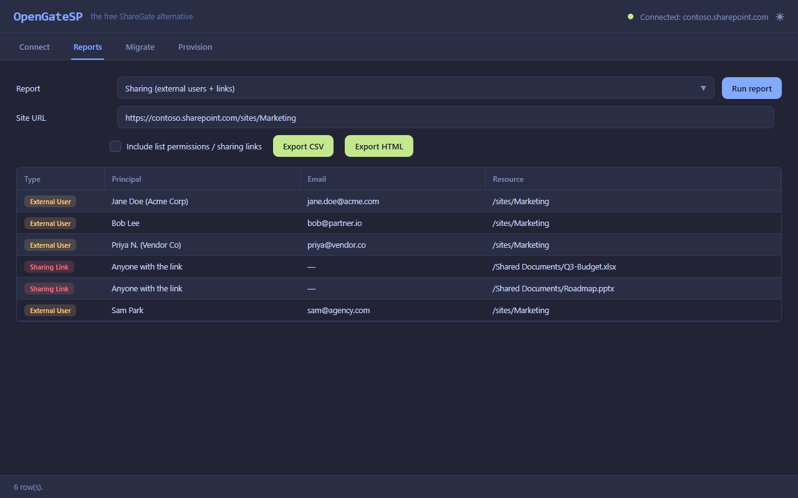
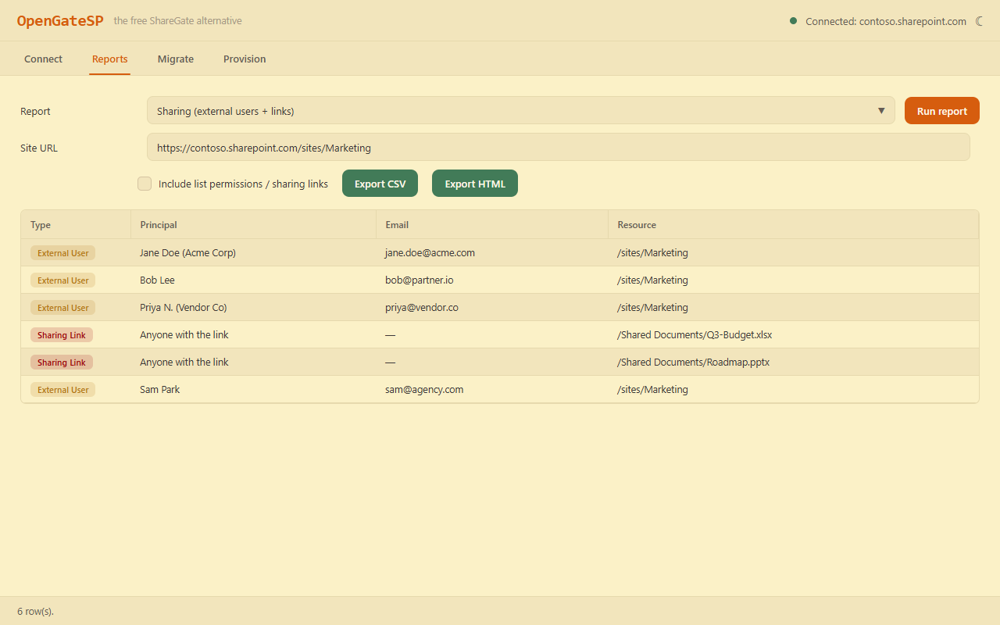

# OpenGateSP

[](https://github.com/sameer-zahir/opengatesp/actions/workflows/ci.yml)
[](https://github.com/sameer-zahir/opengatesp/releases/latest)
[](LICENSE)


> **The free, open-source [ShareGate](https://sharegate.com) alternative** for SharePoint Online and Microsoft 365 — **migrate** file shares into SharePoint, **audit** permissions and external sharing, and **provision** sites. A themed Windows app, a PowerShell engine, and an MCP server so your AI assistant can drive it. MIT-licensed.



## Download & run (about 60 seconds)

1. **[Download the latest release](https://github.com/sameer-zahir/opengatesp/releases/latest)** and unzip it.
2. Double-click **`OpenGateSP.exe`** (or `Start-OpenGateSP.cmd`).
3. On first run it installs the engine and shows you the one-time (free) Entra app registration, then opens the app.

> Needs **Windows + PowerShell 7.4+**. The `.exe` is an *unsigned* launcher, so Windows SmartScreen shows a one-time **"More info → Run anyway."** Prefer `Start-OpenGateSP.cmd` if you'd rather run the visible script — it's all open source.

## OpenGateSP vs ShareGate

ShareGate is, under the hood, scripts behind a GUI — and it costs thousands per year. OpenGateSP is those scripts, free and modern.

| | ShareGate | OpenGateSP |
|---|---|---|
| **Price** | thousands / year | **Free (MIT)** |
| File share / folder → SharePoint migration | ✅ | ✅ |
| Permissions & external-sharing audit | ✅ | ✅ |
| Site provisioning + CSV bulk metadata | ✅ | ✅ |
| Drive it from an AI assistant (MCP) | — | **✅ built in** |
| Open source you can read, fork, and own | — | **✅** |
| Tenant-to-tenant, Teams, full content reorg | ✅ | on the roadmap |

OpenGateSP doesn't (yet) match ShareGate's full migration surface — it nails the common 80%: file-share migration, governance reporting, and provisioning, free and scriptable.

## Light & dark, built in

The GUI ships in warm **Gruvbox light** and deep **Tokyo Night Moon dark** (the [Squintless](https://github.com/sameer-zahir/squintless) palettes), with a one-click toggle.



## What it does (v0.1.0)

| Area | Function | What it does |
|---|---|---|
| **Migration** | `Start-SPFileMigration` | Local file share / folder → SharePoint library, preserving structure + timestamps. Dry-run by default. |
| **Reporting** | `Get-SPSiteInventory` | Tenant-wide sites + storage + last activity |
| | `Get-SPPermissionReport` | Who has access; where inheritance is broken |
| | `Get-SPSharingReport` | External users and sharing links |
| **Provisioning** | `New-SPSiteFromTemplate` | Create a site or library from a template |
| | `Set-SPBulkMetadata` | CSV-driven bulk column updates |

Same engine, three ways to use it: the **GUI**, the **PowerShell** module, or the **MCP server**.

## Drive it from an AI assistant

The [MCP server](mcp-server/) lets Claude / Codex / Gemini run OpenGateSP conversationally — *"show external sharing on /sites/Marketing"*, *"preview migrating C:\Shares\HR into the HR site."* Write tools preview by default. Setup: [mcp-server/README.md](mcp-server/README.md).

## Prefer the CLI?

```powershell
Install-Module PnP.PowerShell -Scope CurrentUser
Register-PnPEntraIDAppForInteractiveLogin -ApplicationName "OpenGateSP" -Tenant contoso.onmicrosoft.com
Import-Module ./module/OpenGateSP/OpenGateSP.psd1
Connect-SPTool -Url https://contoso.sharepoint.com -ClientId <id> -Tenant contoso.onmicrosoft.com -SaveConfig
Get-SPSharingReport -SiteUrl https://contoso.sharepoint.com/sites/Marketing
```

Full guide: [docs/03-quickstart.md](docs/03-quickstart.md) · setup: [docs/01](docs/01-prerequisites.md), [docs/02](docs/02-entra-app-registration.md), headless/scheduled: [docs/05](docs/05-app-only-auth.md).

## Safety

- **Delegated auth** — the tool can never exceed your own SharePoint permissions. **App-only certificate** auth ([docs/05](docs/05-app-only-auth.md)) for headless / scheduled runs.
- **Write operations are cautious** — migration, bulk metadata, and provisioning support `-WhatIf`/`-Confirm` and the MCP tools preview by default. **Test against a throwaway site before production.**
- No client secret in the default setup, so there's nothing secret to leak.

## Roadmap

Tenant-to-tenant and full-site migration · Teams/Group migration · scheduled-report examples · PowerShell Gallery publish. See [docs/roadmap.md](docs/roadmap.md).

## License

[MIT](LICENSE).

---

<sub>OpenGateSP is an independent open-source project, not affiliated with or endorsed by ShareGate or Workleap. "ShareGate" is a trademark of its respective owner.</sub>
