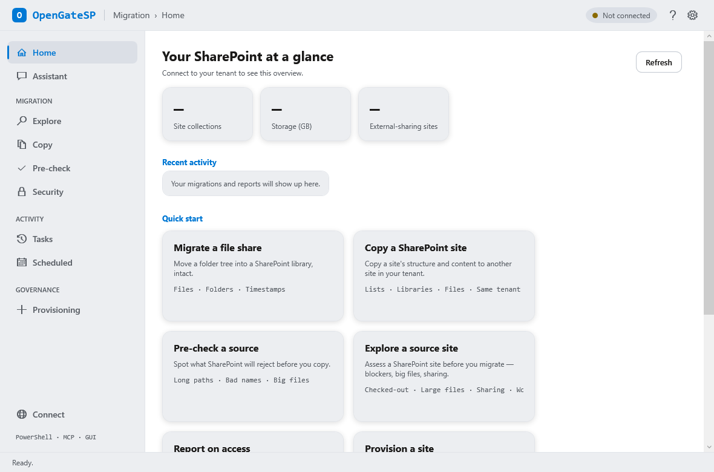
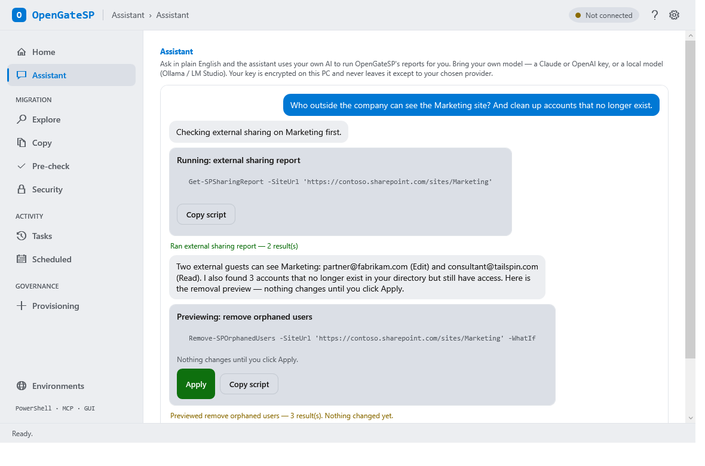
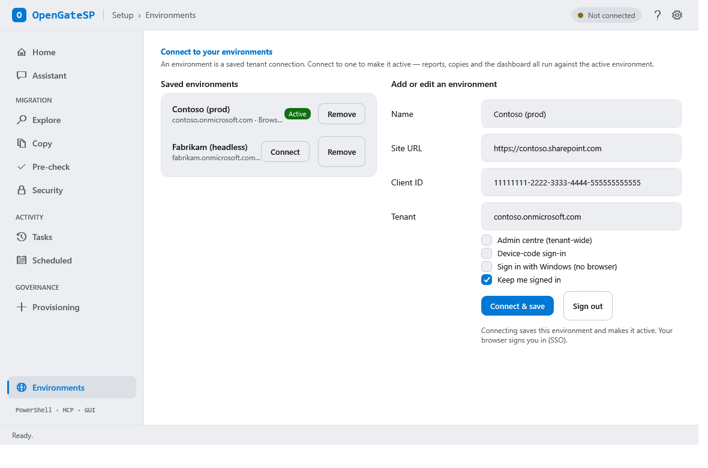

# OpenGateSP

[](https://github.com/sameer-zahir/opengatesp/actions/workflows/ci.yml)
[](https://github.com/sameer-zahir/opengatesp/releases/latest)
[](LICENSE)


> **The free, open-source alternative to [ShareGate](https://sharegate.com)** for SharePoint Online
> and Microsoft 365. Migrate file shares, copy sites and Teams, see who has access to what, clean
> up the mess, and schedule the reports — with a built-in AI assistant that runs on **your own**
> model. No tiers, no trials, no sales call.



## Download & install

1. **[Download `OpenGateSP-Setup.exe`](https://github.com/sameer-zahir/opengatesp/releases/latest)** and double-click it.
2. If Windows shows a SmartScreen warning, click **More info → Run anyway**. (The app isn't
   code-signed yet — free open-source signing via [SignPath](https://signpath.org/) is in
   progress, and `winget install` is on the way.)
3. That's it. It installs just for you (no admin rights needed). First launch lets you pick a
   theme, signs you in to Microsoft 365 with a **one-click guided setup** — no copy-pasting
   commands — and gives you a quick tour.

Prefer no installer? Grab the `.zip` from the same page, unzip, and run `OpenGateSP.exe`.
You'll need **Windows** and **PowerShell 7.4+** — the installer points you to it if it's missing.

## What can it do?

**Migrate a file share into SharePoint.** Point it at a folder, pick a library, preview exactly
what will happen, then run it — folder structure and timestamps preserved. A pre-check catches
what SharePoint would reject (too-long paths, illegal names, oversized files) *before* you move
anything.

**Copy sites, Teams & Groups.** Copy a site's lists, libraries, and content to another site — in
your tenant or a different one. Clone a Team with its channels and members, a Microsoft 365
Group, or a Planner plan. Bring permissions along, remapping people with a simple CSV — or go
further and **copy the identities themselves**: inventory a tenant's users and groups, review a
mapping CSV, and recreate them in the destination tenant (PowerShell/MCP; passwords and licenses
never migrate, by design).

**See who has access to what.** External sharing, full permission reports, a who-can-touch-what
matrix, "Everyone" oversharing, ownerless Groups, and people who left the company but still have
access. Each is one click, and everything exports.

**Clean up.** Check in files people left checked out, trim bloated version history, fix broken
permission inheritance, remove stale users, archive dead sites. Everything previews first.

**Schedule the reports.** Governance reports as CSVs on a daily or weekly schedule, no sign-in
needed once set up.

**Connect to your environments.** Save each tenant as a named environment and switch with one
click — your browser signs you in (SSO), "keep me signed in" survives restarts if you opt in,
and Windows Hello sign-in is available after a one-time app tweak.

Every button in the app is also a PowerShell command you can read and script — the guides in
[docs/](docs/) cover each area, start with the [quickstart](docs/03-quickstart.md).

## The AI assistant



Ask in plain English — *"who outside the company can see the Marketing site?"* — and the built-in
assistant runs the right report and explains what it found. It uses **your own AI**: paste a
Claude or OpenAI key you already have, or run a free local model (Ollama / LM Studio) so nothing
ever leaves your machine.

It can look, but it can't touch. The assistant is read-only until you flip a switch — and even
then, every change shows a **preview card first**, and nothing happens until *you* click
**Apply** on it. Your key is encrypted on this PC; nothing is bundled, so it all stays free.
Details: [docs/13-ai-assistant.md](docs/13-ai-assistant.md).

## How it compares to ShareGate

ShareGate is a polished, expensive tool for work that comes down to SharePoint API calls anyone
can script. OpenGateSP does that work in the open, for free. (It's an independent project built
on [PnP PowerShell](https://pnp.github.io/powershell/) — not affiliated with ShareGate.)

| | ShareGate | OpenGateSP |
|---|---|---|
| **Price** | thousands / year | **Free (MIT)** |
| File share → SharePoint migration | ✅ | ✅ |
| Pre-migration check & source assessment | ✅ | ✅ |
| Permissions & external-sharing audit | ✅ | ✅ |
| Tenant-to-tenant, Teams, Groups & Planner | ✅ | ✅ |
| Post-migration validation | ✅ | ✅ |
| Cleanup: check-in, versions, inheritance | ✅ | ✅ |
| Scheduled governance reports | ✅ | ✅ |
| Site provisioning + CSV bulk metadata | ✅ | ✅ |
| **Built-in AI assistant — your own model** | — | **✅** |
| Drive it from your own AI app (MCP) | — | **✅** |
| Open source you can read, fork, and own | — | **✅** |
| Copy identities (Entra tenant-to-tenant) | ✅ | ✅ |
| Connect to environments (saved tenants, SSO) | ✅ | ✅ |
| Full per-version history fidelity | ✅ | best-effort |
| Automated governance policies | ✅ | partial |

The gaps are real and we say so: full version-history fidelity needs the SharePoint Migration
API (best-effort here today), and ShareGate Protect's *automated* policy engine is only
partially covered (OpenGateSP does the reporting and the cleanup, not yet always-on policies) —
both are on the [roadmap](docs/roadmap.md).

## Is it safe?

- **It can only do what you can do.** You sign in as yourself, and the tool can never exceed your
  own SharePoint permissions.
- **Nothing changes without a preview.** Writes are dry-run by default everywhere — the app, the
  AI (locked until you click Apply), PowerShell (`-WhatIf`), and the MCP server. Still, test
  against a throwaway site before production.
- **Nothing to leak.** Sign-in uses your Microsoft account with no client secret, and AI keys are
  encrypted on-device. Report vulnerabilities privately via [SECURITY.md](SECURITY.md).

## For power users

The same engine is a PowerShell module and an MCP server:

```powershell
Install-Module PnP.PowerShell -Scope CurrentUser
Register-PnPEntraIDAppForInteractiveLogin -ApplicationName "OpenGateSP" -Tenant contoso.onmicrosoft.com
Import-Module ./module/OpenGateSP/OpenGateSP.psd1
Connect-SPTool -Url https://contoso.sharepoint.com -ClientId <id> -Tenant contoso.onmicrosoft.com -SaveConfig
Get-SPSharingReport -SiteUrl https://contoso.sharepoint.com/sites/Marketing
```

Setup guides: [prerequisites](docs/01-prerequisites.md), [app registration](docs/02-entra-app-registration.md),
[headless/scheduled auth](docs/05-app-only-auth.md). To drive it from Claude, Codex, or Cursor,
hook up the [MCP server](mcp-server/README.md) — write tools are preview-gated there too.



Four themes, picked on first run, changeable any time.

## Roadmap

Next up: governance auto-remediation policies and access-review campaigns, **identity copy**
(Entra tenant-to-tenant users/groups — ShareGate's "Copy identities"), full version-history
fidelity via the Migration API, and PowerShell Gallery publishing. The full list, including what
already shipped: [docs/roadmap.md](docs/roadmap.md).

## License

[MIT](LICENSE).

---

<sub>OpenGateSP is an independent open-source project, not affiliated with or endorsed by ShareGate or Workleap. "ShareGate" is a trademark of its respective owner.</sub>
